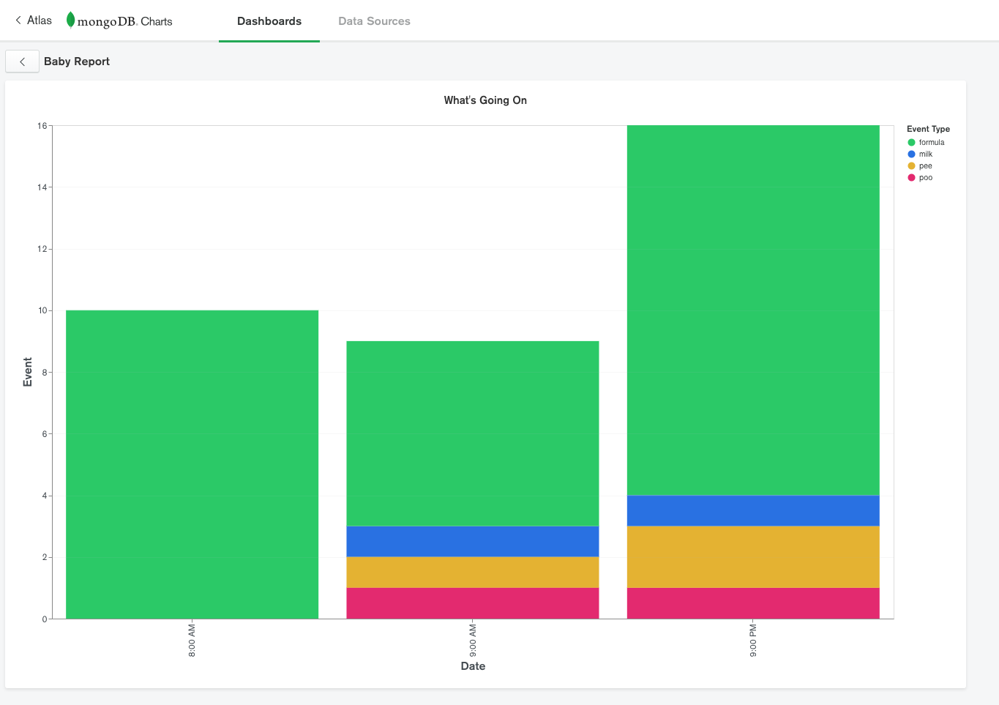
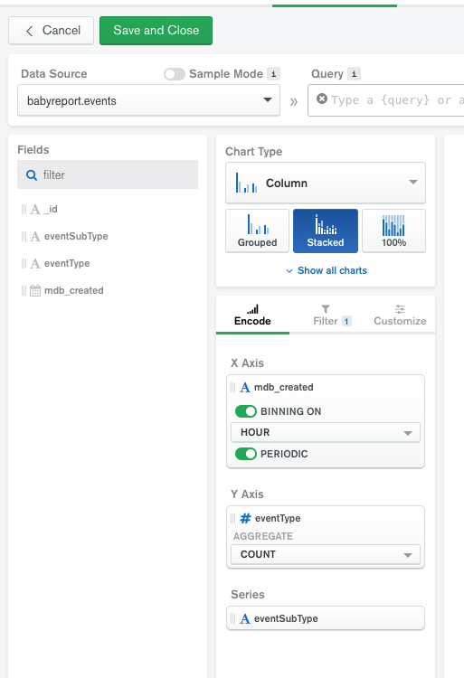
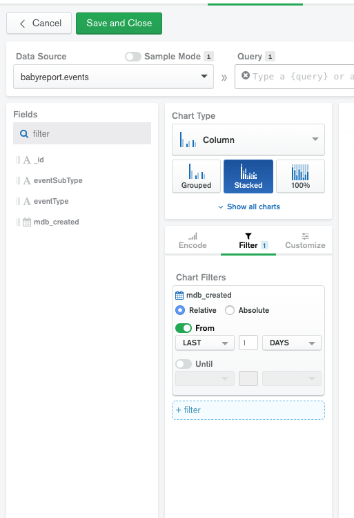

# MongoDB Charts

As of today, you cannot export charts so you must manually configure them via the screenshots below. 

First add the data source, create a chart, then get the path in the `iframe` when you choose to embed it and put that in the `AppConstants.cs` file

